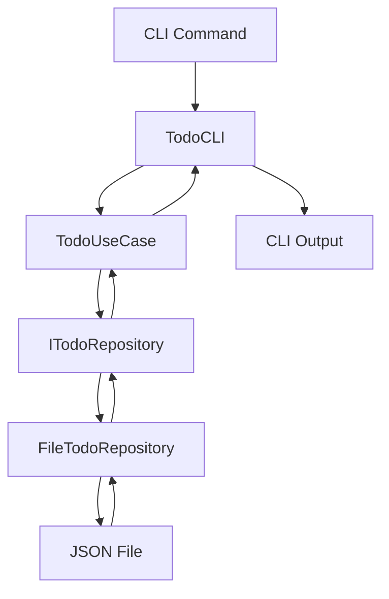

# 🏗 Arquitetura & Design

## Visão Geral

O Todo List CLI implementa **Clean Architecture** (também conhecida como Hexagonal Architecture ou Ports and Adapters), garantindo separação clara de responsabilidades, testabilidade e manutenibilidade.

## 📐 Estrutura em Camadas

### 1. **Domain Layer** (Camada de Domínio)
**Localização:** `core/domain/entity/`

A camada mais interna, contendo as **regras de negócio fundamentais** e entidades principais.

```go
// Todo representa uma tarefa no domínio do negócio
type Todo struct {
    ID          string    `json:"id"`
    Title       string    `json:"title"`
    Description string    `json:"description"`
    Completed   bool      `json:"completed"`
    CreatedAt   time.Time `json:"created_at"`
    UpdatedAt   time.Time `json:"updated_at"`
}
```

**Responsabilidades:**
- ✅ Definir entidades de negócio
- ✅ Implementar regras de negócio básicas
- ✅ Manter estado consistente
- ❌ **NÃO** depende de outras camadas

**Métodos de Negócio:**
```go
func NewTodo(title, description string) *Todo
func (t *Todo) MarkAsCompleted()
func (t *Todo) MarkAsIncomplete() 
func (t *Todo) Update(title, description string)
```

### 2. **Application Layer** (Camada de Aplicação)
**Localização:** `core/application/`

Orquestra o fluxo de dados entre as camadas e implementa **Use Cases**.

```go
type TodoUseCase struct {
    todoRepo repository.ITodoRepository
}
```

**Responsabilidades:**
- ✅ Implementar casos de uso específicos
- ✅ Coordenar operações entre entidades
- ✅ Aplicar regras de negócio complexas
- ✅ Gerenciar transações (se necessário)

**Use Cases Implementados:**
```go
func (uc *TodoUseCase) CreateTodo(title, description string) (*entity.Todo, error)
func (uc *TodoUseCase) GetTodoByID(id string) (*entity.Todo, error)
func (uc *TodoUseCase) GetAllTodos() ([]*entity.Todo, error)
func (uc *TodoUseCase) UpdateTodo(id, title, description string) (*entity.Todo, error)
func (uc *TodoUseCase) CompleteTodo(id string) (*entity.Todo, error)
func (uc *TodoUseCase) DeleteTodo(id string) error
```

### 3. **Infrastructure Layer** (Camada de Infraestrutura)
**Localização:** `infrastructure/`

Implementa os **detalhes técnicos** e dependências externas.

#### 3.1 Repository Implementations
**Localização:** `infrastructure/repository/`

```go
// InMemoryTodoRepository - Para testes e desenvolvimento
type InMemoryTodoRepository struct {
    todos map[string]*entity.Todo
    mutex sync.RWMutex
}

// FileTodoRepository - Para persistência em arquivo
type FileTodoRepository struct {
    filename string
    mutex    sync.RWMutex
}
```

**Características Técnicas:**
- 🔒 **Thread-Safe**: Usa `sync.RWMutex` para operações concorrentes
- 💾 **Persistência**: JSON em `~/.todo-cli/todos.json`
- ⚡ **Performance**: Carregamento lazy e cache em memória

#### 3.2 Interface Contracts
**Localização:** `infrastructure/interface/`

Define contratos (interfaces) para **inversão de dependência**.

```go
type ITodoRepository interface {
    Create(todo *entity.Todo) error
    GetByID(id string) (*entity.Todo, error)
    GetAll() ([]*entity.Todo, error)
    Update(todo *entity.Todo) error
    Delete(id string) error
}

type ITodoUseCase interface {
    CreateTodo(title, description string) (*entity.Todo, error)
    GetTodoByID(id string) (*entity.Todo, error)
    GetAllTodos() ([]*entity.Todo, error)
    UpdateTodo(id, title, description string) (*entity.Todo, error)
    CompleteTodo(id string) (*entity.Todo, error)
    DeleteTodo(id string) error
}
```

### 4. **Interface Layer** (Camada de Interface)
**Localização:** `infrastructure/interface/cli/`

Implementa a **interface do usuário** usando Cobra Framework.

```go
type TodoCLI struct {
    todoUseCase app_interfaces.ITodoUseCase
}
```

**Comandos Disponíveis:**
- `create [title] [description]` - Criar nova tarefa
- `list` - Listar todas as tarefas
- `show [id]` - Mostrar detalhes específicos
- `update [id] [title] [description]` - Atualizar tarefa
- `complete [id]` - Marcar como concluída
- `delete [id]` - Remover tarefa

## 🔄 Fluxo de Dados



### Exemplo: Criação de Tarefa

1. **CLI:** `todo create "Estudar Go" "Clean Architecture"`
2. **TodoCLI:** Processa argumentos e chama `CreateTodo()`
3. **TodoUseCase:** Cria entidade `Todo` e chama repository
4. **Repository:** Persiste no arquivo JSON
5. **Response:** Retorna sucesso através das camadas
6. **CLI:** Exibe confirmação formatada

## 🎯 Princípios Aplicados

### Dependency Inversion (Inversão de Dependência)
```go
// ❌ Dependência direta (acoplamento forte)
type TodoUseCase struct {
    repo *FileTodoRepository  // Dependência concreta
}

// ✅ Inversão de dependência (baixo acoplamento)
type TodoUseCase struct {
    repo repository.ITodoRepository  // Dependência abstrata
}
```

### Single Responsibility (Responsabilidade Única)
- **Todo**: Apenas regras de negócio da entidade
- **TodoUseCase**: Apenas orquestração de casos de uso
- **TodoRepository**: Apenas persistência de dados
- **TodoCLI**: Apenas interface de usuário

### Open/Closed (Aberto/Fechado)
```go
// Facilmente extensível para novos tipos de repositório
func main() {
    // var repo repository.ITodoRepository = InMemoryTodoRepository()
    var repo repository.ITodoRepository = FileTodoRepository(dataFile)
    // var repo repository.ITodoRepository = DatabaseTodoRepository(conn)
}
```

## 🧪 Testabilidade

### Mocks e Injeção de Dependência
```go
type MockTodoRepository struct {
    mock.Mock
}

func TestTodoUseCase_CreateTodo(t *testing.T) {
    mockRepo := new(MockTodoRepository)
    useCase := NewTodoUseCase(mockRepo)
    
    // Teste isolado da camada de aplicação
}
```

### Níveis de Teste
1. **Unit Tests**: Cada camada isoladamente
2. **Integration Tests**: CLI completa com mocks
3. **End-to-End Tests**: Arquivo real de persistência

## 🔧 Configuração e Bootstrapping

### Main.go - Composition Root
```go
func main() {
    // 1. Configuração de infraestrutura
    homeDir, _ := os.UserHomeDir()
    dataFile := filepath.Join(homeDir, ".todo-cli", "todos.json")
    
    // 2. Injeção de dependências
    var todoRepo repository.ITodoRepository = fileRepo.NewFileTodoRepository(dataFile)
    todoUseCase := application.NewTodoUseCase(todoRepo)
    todoCLI := cli.NewTodoCLI(todoUseCase)
    
    // 3. Execução
    rootCmd := todoCLI.GetRootCommand()
    rootCmd.Execute()
}
```

## 📈 Vantagens da Arquitetura

### ✅ **Benefícios Obtidos**

1. **Testabilidade**: Cada camada pode ser testada isoladamente
2. **Manutenibilidade**: Mudanças localizadas por responsabilidade
3. **Extensibilidade**: Fácil adição de novas funcionalidades
4. **Flexibilidade**: Troca de implementações sem afetar o core
5. **Separação de Concerns**: Cada camada tem propósito bem definido

### 📊 **Métricas de Qualidade**

| Métrica | Valor | Objetivo |
|---------|-------|----------|
| **Acoplamento** | Baixo | ✅ Interfaces bem definidas |
| **Coesão** | Alta | ✅ Responsabilidades focadas |
| **Testabilidade** | 85%+ | ✅ Mocks e injeção de dependência |
| **Ciclomatic Complexity** | Baixa | ✅ Funções simples e focadas |

## 🚀 Possíveis Extensões

A arquitetura facilita futuras extensões:

### Novos Repositórios
```go
// PostgreSQLTodoRepository
// RedisTodoRepository  
// S3TodoRepository
```

### Novos Use Cases
```go
// SearchTodos(query string)
// ArchiveTodos(olderThan time.Time)
// ExportTodos(format string)
```

### Novas Interfaces
```go
// WebTodoAPI (REST API)
// TodoGUI (Desktop App)
// TodoBot (Slack/Discord)
```

## 📚 Referências

- [Clean Architecture - Robert C. Martin](https://blog.cleancoder.com/uncle-bob/2012/08/13/the-clean-architecture.html)
- [Hexagonal Architecture - Alistair Cockburn](https://alistair.cockburn.us/hexagonal-architecture/)
- [Go Project Layout Standards](https://github.com/golang-standards/project-layout)
- [SOLID Principles in Go](https://dave.cheney.net/2016/08/20/solid-go-design)
